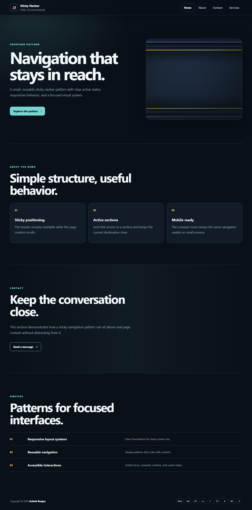

# Sticky Navbar

A small, responsive sticky navigation pattern built with semantic HTML, modern CSS, and vanilla JavaScript.

## Features

- Sticky header with clear active section states
- Smooth section navigation for Home, About, Contact, and Services
- Responsive mobile menu with outside-click closing
- Local background, logo, favicon, and preview assets
- Icon-style social and support links in the footer
- Dynamic copyright year

## Tech stack

HTML, CSS, Sass source, and vanilla JavaScript.

## Run locally

Open index.html in a browser, or serve the folder with any static development server.

## Deployment

Live site: [a2rp.github.io/sticky_navbar_html_css_javascript](https://a2rp.github.io/sticky_navbar_html_css_javascript/)

## Screenshot

## Links

- [Portfolio](https://www.ashishranjan.net/)
- [GitHub](https://github.com/a2rp)
- [CodePen](https://codepen.io/ash1198)
- [LinkedIn](https://www.linkedin.com/in/aashishranjan)
- [Facebook](https://www.facebook.com/theash.ashish/)
- [YouTube](https://www.youtube.com/@ashishranjan-ashz?sub_confirmation=1)
- [Email](mailto:ash.ranjan09@gmail.com)

## Support

- [Support](https://a2rp-donation-page.netlify.app/)
- [Buy Me a Coffee](https://buymeacoffee.com/a2rp)
- [Patreon](https://patreon.com/a2rp)